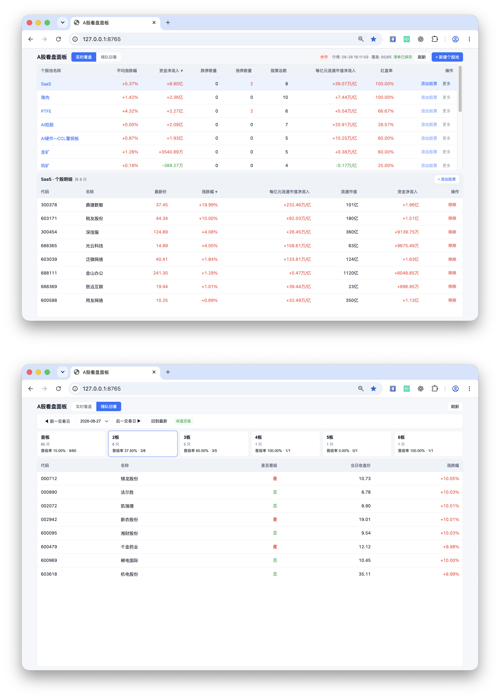

# A 股实时看盘面板

> 面向多个股票池比较、个股下钻与涨停梯队复盘的本地行情数据监控工具。



*图 1：上半部分为多个股票池的盘面总览与个股明细；下半部分为按板位查看涨停梯队及晋级率的回看页面。*

## 1. 项目背景

### 目标用户

- 需要按题材、行业或个人关注逻辑维护多个股票池的个人用户。
- 希望在盘中快速比较不同组合强弱，并在收盘后回看涨停梯队变化的用户。

### 高频使用场景

1. 同时观察多个关注组合，判断哪些组合相对更强。
2. 从股票池汇总指标下钻到个股，定位推动或拖累组合的标的。
3. 对比不同规模股票池的资金表现，避免将资金总额直接等同于相对强度。
4. 收盘后按板位回看涨停梯队，并判断个股的后续晋级情况。

### 用户痛点与需求来源

本项目基于个人高频使用场景观察设计，未虚构外部用户调研或规模化使用数据。核心问题包括：

- 多个关注组合分散在不同列表中，横向比较成本高。
- 单看涨跌幅无法同时判断广度、资金支持与极端强弱信号。
- 股票池规模不同，直接比较资金净流入总额容易产生偏差。
- 数据延迟、接口失败或部分缺失时，用户难以分辨“无变化”与“无数据”。
- 本地配置在多窗口或外部编辑时，可能产生静默覆盖风险。

## 2. 产品目标与边界

### 产品目标

- 将用户关注的股票按自定义组合集中管理，减少跨列表切换。
- 为每个股票池提供统一、可解释的盘面指标，支持横向比较和个股下钻。
- 通过涨停梯队与晋级率，为收盘后的结构化复盘提供基础视角。
- 在数据不完整或写入冲突时，明确呈现数据状态，避免误导和静默覆盖。

### 优先级判断

| 优先级 | 要解决的问题 | 对应方案 |
| --- | --- | --- |
| P0 | 多个关注组合难以快速比较 | 自定义股票池与统一汇总指标 |
| P0 | 汇总结果无法定位原因 | 股票池—个股明细的下钻路径 |
| P0 | 异常数据容易被误读 | 延迟、覆盖率、缺失与最近有效数据提示 |
| P1 | 涨停表现缺少连续性回看 | 涨停梯队快照与晋级率 |
| P1 | 多窗口或外部编辑可能覆盖配置 | 基于版本号的写入校验与冲突重载 |

### 产品边界

- 不提供交易执行、仓位管理、买卖建议或收益承诺。
- 不覆盖全市场研究、资讯研判、财务分析等完整投研流程。
- 不以实时性替代数据质量判断；接口异常时优先保证状态可见与结果可追溯。

## 3. 产品方案

### 产品信息架构

| 模块 | 核心内容 | 支持的用户任务 |
| --- | --- | --- |
| 实时看盘 | 自定义股票池、自动涨停池、核心指标、排序 | 快速比较不同组合的相对强弱 |
| 个股明细 | 最新价、涨跌幅、流通市值、资金流、排序与筛选 | 下钻定位池内驱动项与拖累项 |
| 梯队回看 | 日期切换、板位卡片、晋级率、个股明细 | 复盘连板结构及延续情况 |
| 状态反馈 | 行情时间、覆盖率、延迟提示、保存状态 | 判断数据是否可用、是否需要刷新或重试 |

### 核心操作路径

```text
创建/维护股票池
        ↓
首页横向比较：涨跌、红盘率、资金、涨停数量
        ↓
选择关注股票池，查看个股明细
        ↓
按指标排序或筛选，定位具体标的
        ↓
切换至涨停梯队回看，按板位查看晋级情况
```

## 4. 核心功能设计

### 自定义股票池：把分散关注对象变成可比较的观察单元

**用户问题：** 用户会按题材、行业或个人观察逻辑维护多个关注组合；单一列表无法形成有效比较。

**产品方案：** 支持创建、重命名、删除股票池，搜索并添加股票、从池内移除股票；同一股票可存在于不同股票池，同一股票池内禁止重复添加，股票池名称禁止重复。自动涨停池与自定义池分层处理，自动池不可手动编辑。

**规则与取舍：**

- 支持按名称、平均涨跌幅、涨跌停数量、股票总数、资金净流入、单位市值资金净流入、红盘率排序。
- 保存用户最近一次的排序与列顺序偏好，降低重复配置成本。
- 不设置股票池数量和单池股票数量上限，优先满足个人使用的组织灵活性。
- 未引入复杂标签体系或层级目录，避免在核心任务尚未验证前增加维护负担。

### 股票池盘面指标：用多个维度解释组合强弱

**用户问题：** 单一涨跌幅或资金总额不足以解释股票池的强弱来源。

**产品方案与指标口径：**

| 指标 | 计算口径 | 解决的判断问题 |
| --- | --- | --- |
| 平均涨跌幅 | 池内有效行情股票当前涨跌幅的算术平均值 | 组合整体是偏强还是偏弱？ |
| 红盘率 | 涨跌幅大于 0 的有效股票数 ÷ 有效股票数 | 强势由少数标的拉动，还是具有更广泛的扩散性？ |
| 资金净流入 | 有有效资金数据股票的主力资金净流入合计 | 组合是否存在资金方向性支持？ |
| 每亿元流通市值净流入 | 主力资金净流入合计 ÷ 前收盘流通市值合计 × 10,000，单位为万元/亿元 | 剔除规模差异后，哪个组合的相对资金强度更高？ |
| 涨停 / 跌停数量 | 按不同市场涨跌停规则识别的有效股票数 | 组合是否存在极端强弱信号？ |

**规则与取舍：**

- 停牌、无行情或过期行情不参与平均涨跌幅与红盘率计算。
- 资金缺失的股票不参与资金汇总，界面展示“有效数量 / 总数量”的数据覆盖提示。
- 涨跌停按股票属性识别：主板 10%、ST 5%、创业板 / 科创板 20%、北交所 30%；上市未满两周、规则无法可靠判断的股票不计入涨跌停数量。
- 同时展示资金总额与单位市值资金净流入：前者反映绝对资金规模，后者减少大市值组合的天然优势。

### 个股明细与筛选排序：从异常指标快速定位原因

**用户问题：** 发现某个股票池走强后，用户还需要判断具体由哪些个股推动，以及资金是否集中。

**产品方案：** 点击股票池后展示池内个股明细，支持按代码、名称、最新价、涨跌幅、流通市值、资金净流入、单位市值资金净流入排序；自动涨停池支持“剔除 ST”“仅看主板”筛选。

**规则与取舍：**

- 个股资金强度与股票池层使用同一计算逻辑，避免口径不一致。
- 数据缺失统一显示为 `--`，不以零值替代。
- 采用“总览—明细”两层结构，先帮助用户判断方向，再支持定位原因。
- 大量个股场景仅渲染可视区域，减少高频刷新对浏览连续性的影响。

### 涨停梯队回看：补足单日涨停数量之外的连续性信息

**用户问题：** 涨停数量只能反映单日结果，无法说明不同板位的延续性。

**产品方案：** 按交易日保存涨停梯队快照，将个股按首板、二板及更高板位分组展示；支持历史日期与板位切换，默认聚焦最高板位，并展示个股、收盘价、涨跌幅和晋级状态。

**指标与规则：**

- 若 D 日处于 N 板的个股在下一实际交易日达到 N+1 板，记为“晋级”。
- 晋级率 = 晋级个股数 ÷ 可评估个股数。
- 最新交易日如下一交易日行情尚不可用，则展示“待确认”；无法可靠评估时展示“不可评估”，不伪造晋级结果。
- 仅将完整、校验通过且收盘定版的快照写入历史记录。

**设计取舍：** 使用下一实际交易日而非自然日判断晋级，规避周末和节假日导致的误判；将历史定版与盘中状态分开，优先保证历史数据可追溯。

### 数据异常与降级体验：让数据状态可见、可理解

| 异常场景 | 产品处理 |
| --- | --- |
| 行情接口请求失败 | 保留最近一次有效数据，提示数据更新失败，支持手动刷新重试 |
| 部分行情返回失败 | 显示实时数据覆盖数；未返回的股票显示 `--` |
| 交易时段数据延迟 | 展示行情时间与“数据可能已延迟”提示 |
| 无实时行情 | 明确提示当前无实时数据，不以零值替代 |
| 空股票池 | 展示空状态并提供创建或添加股票的引导 |
| 个股池文件读取异常 | 阻断继续写入并展示错误信息，避免错误文件被覆盖 |
| 多窗口 / 外部编辑冲突 | 写入时校验文件版本；发现冲突后重新加载最新版本，避免静默覆盖 |
| 涨停梯队数据不完整 | 展示“待确认 / 不可评估”，不生成虚假晋级率 |

## 5. 产品亮点

### 需求分析与优先级判断

- 将“多个自选列表”拆解为“股票池横向比较—个股下钻—梯队复盘”三类核心任务。
- 优先投入 P0 的组合比较、下钻定位与数据状态反馈；将交易、荐股、全市场研究等非核心能力明确排除在范围之外。

### 指标设计能力

- 用平均涨跌幅回答组合方向，用红盘率回答强度广度，用绝对资金与单位市值资金流同时解释资金强度。
- 为涨停梯队定义可追溯的晋级规则，并将“待确认”“不可评估”纳入状态体系，避免数据不足时制造确定性结论。

### 交互与异常体验

- 通过总览—明细的双层路径控制信息密度，减少用户在高频场景中的切换成本。
- 将更新时间、数据覆盖率、延迟、接口失败、空状态和保存冲突转译为用户可理解的反馈。
- 在数据接口失败时保留最近一次有效数据，在配置冲突时拒绝静默覆盖，平衡使用连续性与数据可靠性。

### 成果说明

已完成股票池管理、盘面指标、个股明细、自动涨停池、历史梯队回看及异常状态处理的端到端实现。项目尚未提供真实用户规模、使用频次、效率提升或业务结果数据，相关量化成果不作虚构。
